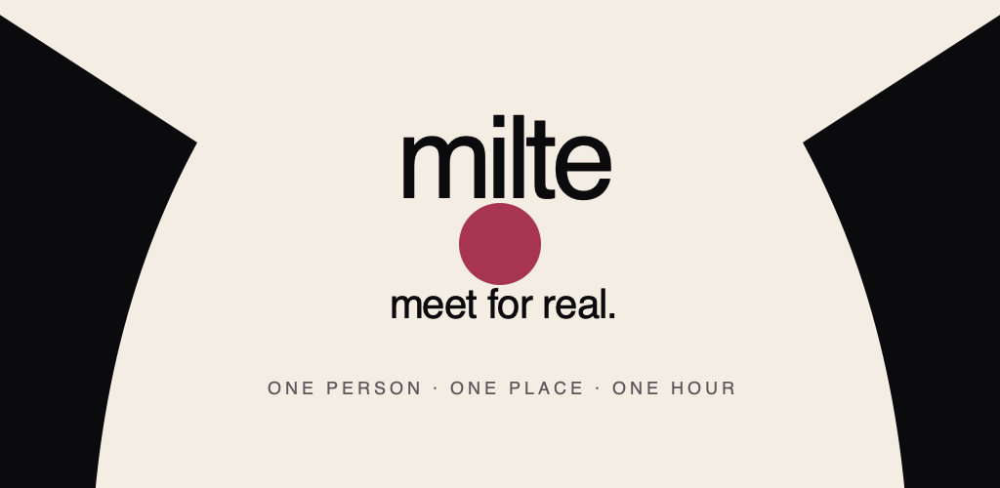
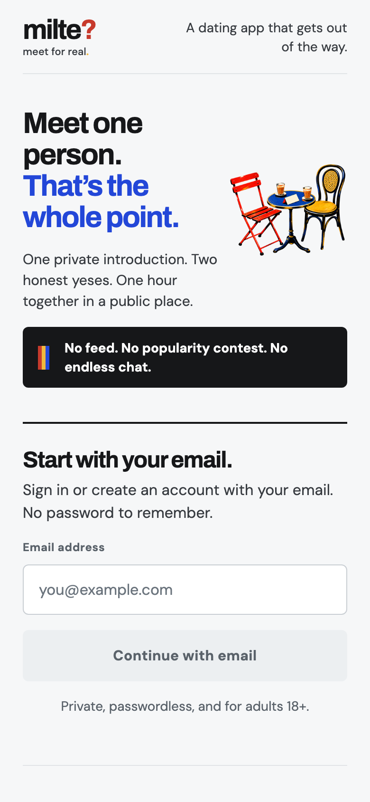
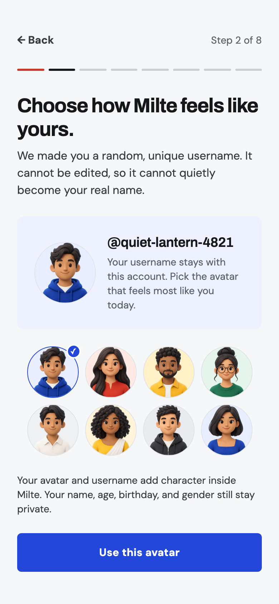
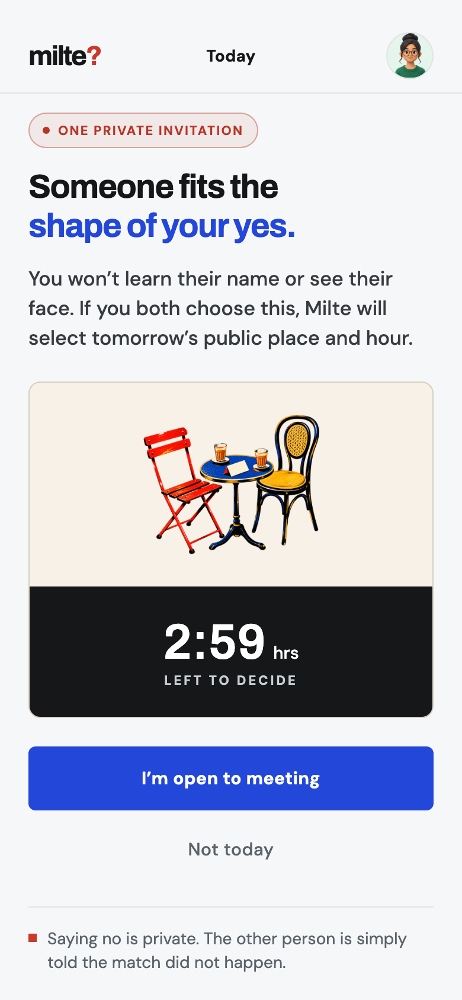
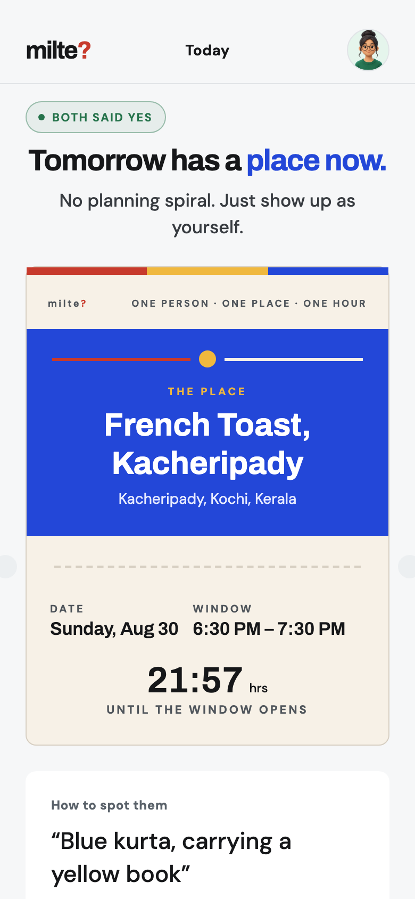
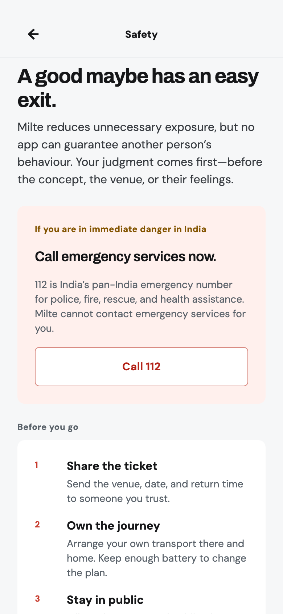
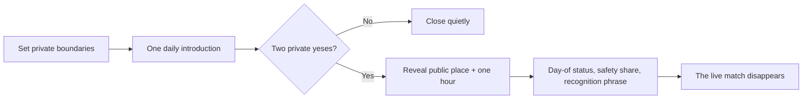
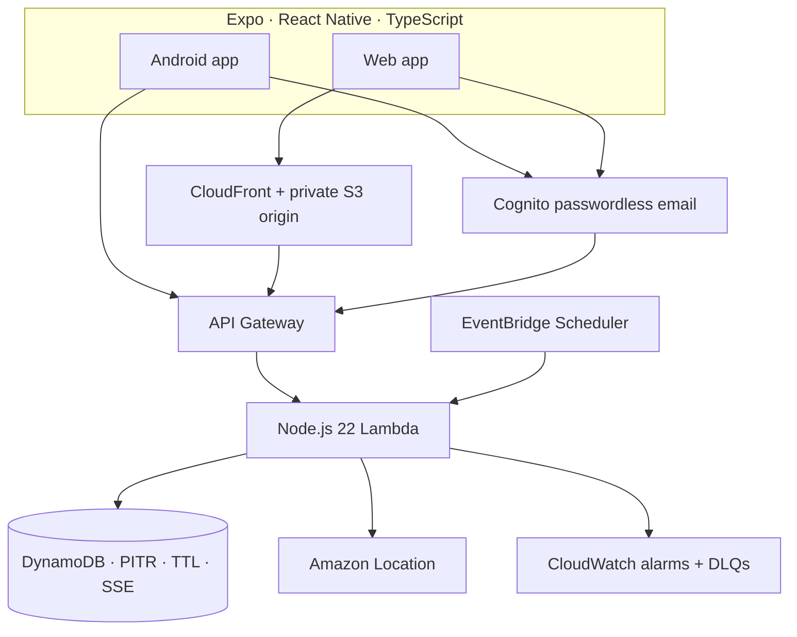

<p align="center">
  
</p>

<p align="center">
  <strong>A dating app that gets out of the way.</strong><br />
  One private introduction. Two honest yeses. One real hour in a public place.
</p>

<p align="center">
  <a href="https://d1w5h7ki7ldbx2.cloudfront.net">Open the live web app</a>
  &nbsp;·&nbsp;
  <a href="docs/PRODUCT_PRINCIPLES.md">Product principles</a>
  &nbsp;·&nbsp;
  <a href="docs/RELEASE_READINESS.md">Release readiness</a>
  &nbsp;·&nbsp;
  <a href="docs/TRUST_SAFETY_RUNBOOK.md">Trust &amp; safety</a>
</p>

<p align="center">
  <code>Android 1.0.0 (7)</code>
  &nbsp;
  <code>Closed Alpha · India</code>
  &nbsp;
  <code>AWS · ap-south-1</code>
  &nbsp;
  <code>Expo SDK 57</code>
</p>

---

## Dating should lead to a date

Most dating products turn people into an endless catalogue. Milte does the
opposite: it creates one calm, private chance to meet someone compatible and
then gets off the screen.

On an available day, Milte may introduce one nearby person whose hard
boundaries also fit yours. You decide independently. Only after **two private
yeses** does the app reveal a named public place, a one-hour window, and a clue
for recognising each other. There is no feed to refresh, profile to perform,
chat to maintain, or popularity score to win.

When the hour ends, the live match disappears.

<p align="center">
  
</p>

## The experience

<table>
  <tr>
    <td align="center" width="20%"></td>
    <td align="center" width="20%"></td>
    <td align="center" width="20%"></td>
    <td align="center" width="20%"></td>
    <td align="center" width="20%"></td>
  </tr>
  <tr>
    <td align="center"><sub>Begin privately</sub></td>
    <td align="center"><sub>Choose your character</sub></td>
    <td align="center"><sub>Make one honest choice</sub></td>
    <td align="center"><sub>Meet in public</sub></td>
    <td align="center"><sub>Stay in control</sub></td>
  </tr>
</table>



### What makes Milte different

| Familiar dating pattern | Milte |
|---|---|
| Endless cards and swipe decisions | One active possibility at a time |
| Photos, bios and self-promotion | No public profile or beauty contest |
| Engagement ranking and popularity signals | Mutual hard boundaries before a private match |
| Open-ended pre-date chat | Clear logistics and four day-of status signals |
| Vague “let's meet sometime” coordination | One named public place and one-hour window |
| A permanent inbox and match archive | The live match expires after the meeting |

Milte does not need café partnerships or venue approval. The production service
looks up a current, named public place between both members; if it cannot verify
one, the commitment fails safely instead of inventing a venue.

## Identity without a beauty standard

Every member receives a unique, immutable `adjective-noun-0000` username and
chooses one of eight softly stylised character avatars. They give the product
life without exposing a photo, encouraging comparison, or allowing a handle to
quietly become a real name.

The visual system is intentionally light, optimistic and direct:

- **Archivo** for decisive display type; **DM Sans** for everything operational.
- City Paper, ink, ultramarine, signal red and marigold—used with restraint.
- Original screen-print meeting art instead of stock couples or dating clichés.
- Flat functional surfaces, compact geometry and no gradient/glass/glow theatre.
- A crisp physical ticket as the one celebratory product moment.

The enforceable system lives in [`DESIGN.md`](DESIGN.md); the research synthesis
and Mobbin reference flows are documented in
[`docs/UI_UX_REVAMP.md`](docs/UI_UX_REVAMP.md).

## Privacy and safety are part of the main flow

Mystery may hide identity. It must never hide consequences, timing or control.

- Names, birthdays, gender, exact location and profile records never reach another client.
- Foreground location is approximate and rounded on-device before transmission.
- Venue and recognition details appear only after two private yeses.
- The recognition phrase remains hidden until shortly before the meeting.
- A private “no” never hurts a ranking or tells the other person who declined.
- Reporting immediately ends the match and permanently blocks re-matching.
- Safety sharing, independent transport guidance and India `112` are available from the date flow.
- Account deletion removes the Cognito identity and user-owned records, retaining only the documented minimal safety trail.

Read the plain-language [product principles](docs/PRODUCT_PRINCIPLES.md),
[privacy model](docs/RELEASE_READINESS.md), and operational
[trust-and-safety runbook](docs/TRUST_SAFETY_RUNBOOK.md).

## Architecture

Milte is a single Expo application for Android and web, backed by a serverless
AWS runtime in Mumbai. Supabase remains only as archived prototype/reference
code and is not connected to production.



| Layer | Production choice |
|---|---|
| App | Expo SDK 57, React Native 0.86, expo-router, React Query, Reanimated |
| Identity | Amazon Cognito passwordless email OTP |
| API | API Gateway + resource-scoped Node.js 22 Lambda |
| Data | DynamoDB on-demand with conditional transactions, PITR, TTL and SSE |
| Places | Amazon Location current public-place lookup; no fabricated fallback |
| Jobs | Retry-safe daily matching and 15-minute housekeeping schedules |
| Web | Private S3 origin behind CloudFront with CSP, HSTS and strict CORS |
| Operations | 30-day logs, six alarms, DLQs and a bounded AWS budget |

## Quality evidence

The release gate is executable, not aspirational:

- **80/80** application/domain tests.
- **27/27** isolated production Lambda tests.
- **6/6** browser authentication journeys, including six- and eight-digit Cognito codes.
- **13** responsive visual states with geometry checks at standard and 320×568 widths.
- Strict TypeScript, Expo dependency alignment and Expo Doctor **21/21**.
- SAM lint/build, live AWS health/CORS/security-header checks and support persistence canary.
- Exact signed version-7 APK fresh-installed and cold-launched on Android API 24 and 36.
- APK/AAB signature, permission, ABI, secret/source-map and 16 KB alignment checks.
- Google Play accepted version code 7 with zero supported-device loss; the Alpha release is in review.

Run the same repository gate with:

```sh
npm run release:verify
```

The frozen artifact hashes, infrastructure controls and test evidence are in
[`docs/RELEASE_EVIDENCE.md`](docs/RELEASE_EVIDENCE.md). Human and external gates
remain explicit in [`docs/RELEASE_READINESS.md`](docs/RELEASE_READINESS.md).

## Run locally

### Prerequisites

- Node.js 22
- npm
- Android Studio/SDK for native Android work
- AWS SAM CLI only when validating or deploying the backend

```sh
git clone https://github.com/vaishakh3/mitle.git
cd mitle

npm ci
npm --prefix apps/mobile ci --legacy-peer-deps
cp apps/mobile/.env.example apps/mobile/.env

npm --prefix apps/mobile start
```

The checked-in Expo configuration points at the controlled production beta.
Use environment overrides in `apps/mobile/.env` for an isolated stack. Never
commit credentials or upload-key material.

### Useful commands

```sh
npm test                 # domain and product tests
npm run typecheck        # shared + mobile TypeScript
npm run test:e2e         # browser authentication journeys
npm run test:ui          # responsive visual audit
npm run aws:test         # production Lambda tests
npm run release:verify   # full source release gate
npm run android:release  # locally signed APK + AAB
npm run android:inspect  # package/signature/policy inspection
```

Android signing material lives outside Git. The independent local release path
does not depend on EAS cloud builds; see
[`docs/ANDROID_RELEASE.md`](docs/ANDROID_RELEASE.md).

## Repository map

```text
apps/mobile/           Expo Android + web product
infra/aws/             Production SAM stack and Lambda application
brand/milte/           Identity sources, prompts and asset manifest
store/                 Google Play listing, policy declarations and graphics
tests/                 Product, release and accessibility invariants
scripts/               Release, visual-audit and asset-generation tooling
docs/                  Product, design, operations and evidence trail
supabase/               Archived prototype/reference implementation
```

## Release state

| Surface | State |
|---|---|
| Web | Deployed on AWS CloudFront |
| Android package | `app.milte` · `1.0.0 (7)` · API 24–36 |
| Google Play | Alpha closed test · India · version 7 in review |
| Production access | External closed-test duration/tester-count gate |

Public rollout also remains gated on legal approval, a named adult safety
operator, physical-device accessibility/intent testing, the invite-only safety
pilot, and AWS SES production approval. Those are recorded honestly rather than
hidden behind a “production ready” badge.

---

<p align="center">
  <strong>milte?</strong><br />
  <sub>meet for real.</sub>
</p>
