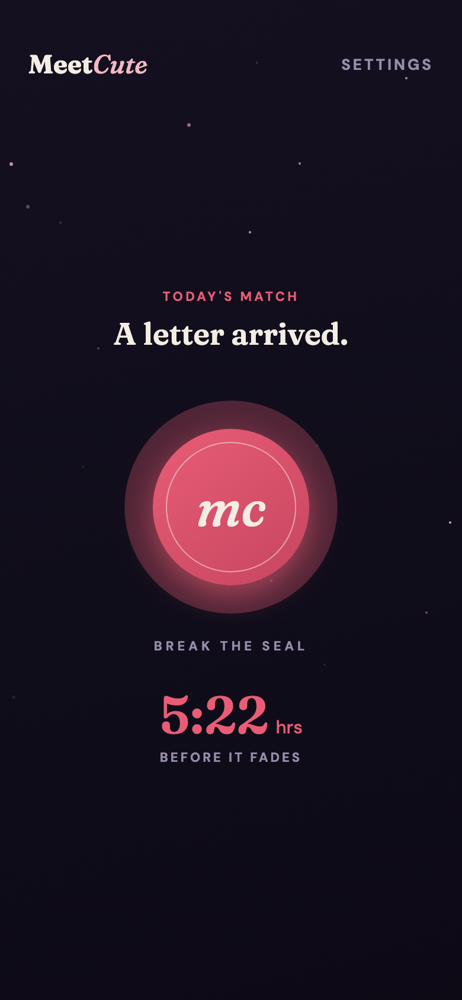
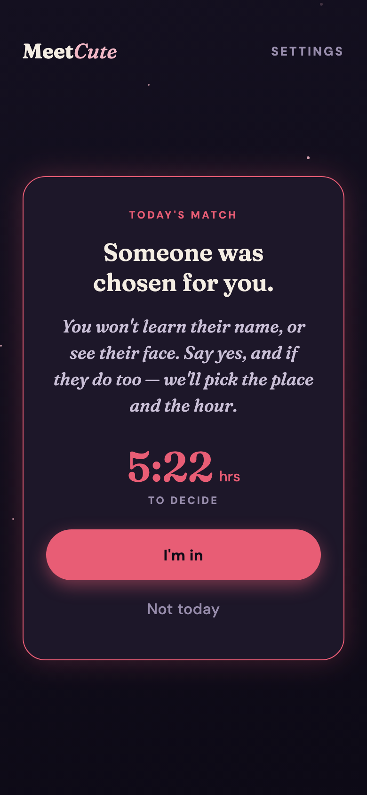
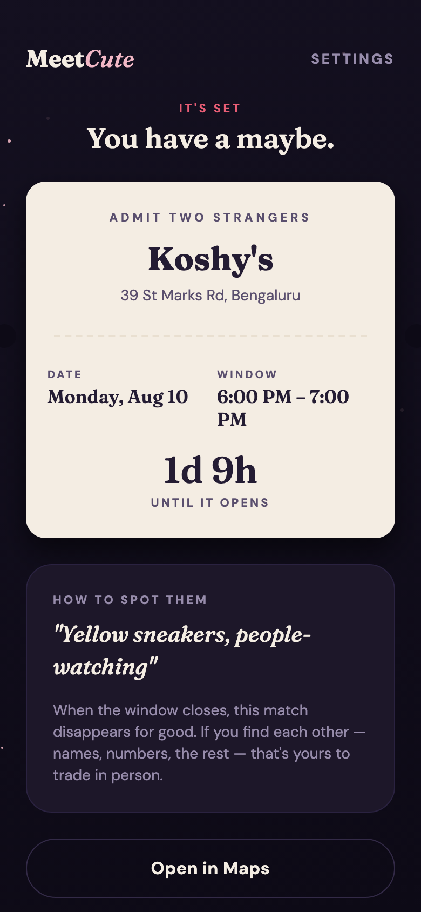
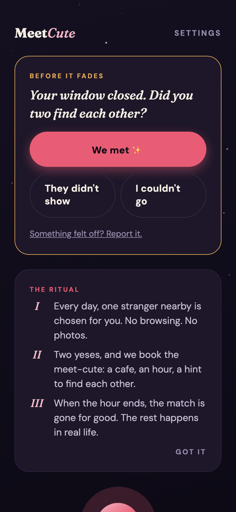
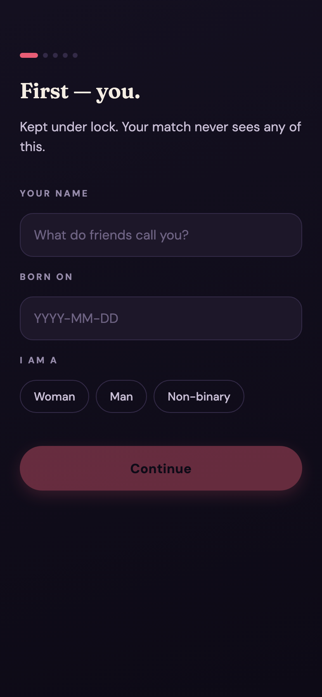

<p align="center">
  
</p>

<p align="center">
  <em>The dating app that refuses to be an app.</em><br/>
  No photos. No chat. No swiping. One random match a day — and the only way it continues is if you actually show up.
</p>

<p align="center">
  
  
  
  
</p>

---

## The idea

Meet-cutes happen by accident. This app manufactures the accident.

Every day, a hidden algorithm pairs you with **one** stranger nearby. You never see their name, face, or profile — there isn't one. If you both say *"I'm in"*, the app books the meet-cute for you: a real cafe roughly halfway between you, a one-hour window, and a single self-written hint to find each other by (*"red scarf, probably reading a book"*).

When the hour ends, the match is deleted. Forever. No chat to fall back on, no profile to revisit. If you found each other, you trade names and numbers **in person** — the app's job is done.

> **Happily offline.** The product is designed to disappear from your love story as fast as possible.

## Screens

| The door | The letter | The decision |
|:---:|:---:|:---:|
|  |  |  |

| The ticket | The closure | The beginning |
|:---:|:---:|:---:|
|  |  |  |

## The ritual

```
        every day, one cron job plays cupid
                        │
                 match created ──── sealed, anonymous, 6h to decide
                        │
         ┌── either declines / clock runs out ──► dissolved. tomorrow is tomorrow.
         │
   both say yes
         │
   the app books it ──── a cafe between you two + a one-hour window
         │                (venue via Google Places, revealed only now)
         │
   window closes ──────► match deleted from the app, forever
                          └─► "did you meet?" — one anonymous tap
```

**The rules, and why they exist:**

- **One match a day, max.** Scarcity is the feature. You can't grind it like a slot machine.
- **Fully anonymous.** Chemistry gets one hour in person — not two weeks of texting to talk itself out of it.
- **Both must opt in.** Nobody waits at a cafe for someone who never wanted to come.
- **The app picks the place & time.** Zero coordination. Coordination is where the magic dies.
- **Matches self-destruct.** No archive, no re-match, no second chances. Like real life.

## How the "hidden algorithm" works

Pure TypeScript, unit-tested, deliberately under-optimized:

```
score = 0.35 · interest_overlap  +  0.25 · distance_decay  +  0.40 · random_jitter
```

Hard mutual filters first (gender ↔ interest, both age ranges, the *smaller* of the two radii, never a previous pair) — then the jitter dominates on purpose. It's supposed to feel like fate, not a ranking.

## Anonymity as architecture

Anonymity isn't a UI choice here — it's structurally enforced in Postgres:

- The `matches` table has **deny-all RLS**. No client can `SELECT` from it. Ever.
- Everything a client learns arrives through `get_current_match()`, a `SECURITY DEFINER` RPC that returns only: status, deadline — and after both accept, the venue, the window, and the other person's spot hint. No IDs, no names.
- Other users' `profiles` rows are unreadable, full stop.
- Ended matches are deleted from the user-facing table and archived server-side (pair + outcome only) — powering never-re-match and a confidential report flow, without keeping anything sentimental.

## Feature tour

| | |
|---|---|
| 💌 **Break the seal** | Today's match arrives as a pulsing wax seal you crack open — the daily ritual |
| 🎟️ **The ticket** | A committed match renders as a cream paper stub: *ADMIT TWO STRANGERS* |
| ⏳ **Live countdowns** | To decide, until the window opens, and while it burns down |
| 🧭 **Venue picking** | Google Places (New) finds a well-rated cafe near your geographic midpoint — mock venue fallback for local dev |
| 🔔 **Pushes that matter** | Match arrived · it's on · window opens soon (the no-show killer) · the goodbye |
| 🤝 **Share plans with a friend** | One tap sends your meet plan to someone you trust — safety with a side of word-of-mouth |
| ✅ **"Did you meet?"** | Anonymous one-tap closure after the window; doubles as the confidential report entry point |
| 🌒 **Midnight editorial design** | Fraunces + DM Sans, candlelit palette, starfield, breathing orb — Hinge-grade type, zero neon |

## Stack

```
apps/mobile              Expo SDK 57 · React Native · TypeScript · expo-router
                         @tanstack/react-query · reanimated 4 · expo-notifications
supabase/migrations      Postgres schema · deny-all RLS · SECURITY DEFINER RPCs
supabase/functions       Deno edge functions
  ├─ daily-match         cron: pool → filters → scoring → greedy pairing → push
  ├─ respond-match       accept/decline · race-safe commits · venue + window booking
  └─ expire-matches      cron: expiry sweeps · archival · pre-window reminders
supabase/functions/_shared   pure-TS matching/time/venue logic (vitest-tested)
scripts/                 seeding · cron triggers · 33-check e2e · README screenshots
```

## Run it locally

Prereqs: Node 20+, Docker (Colima works fine).

```sh
git clone https://github.com/vaishakh3/meetcute.git && cd meetcute
npm install

npm run db:start            # local Supabase (applies migrations)
npm run seed                # 7 fictional romantics around Bangalore
npm run functions:serve     # edge functions (keep running)

cd apps/mobile
npm install --legacy-peer-deps
cp .env.example .env        # paste URL + anon key from `npx supabase status`
npx expo start              # Expo Go on your phone, or press `w` for web
```

Then play cupid yourself:

```sh
npm run trigger:match       # run the daily matcher right now
npm run trigger:expire      # sweep expiries / send window reminders
```

OTP emails land in **Mailpit** at http://127.0.0.1:54324. Seed users also sign in with password `meetcute-test-123`.

### Secrets (`supabase/functions/.env`)

| Var | Purpose |
|---|---|
| `GOOGLE_PLACES_API_KEY` | Real cafes; leave empty for the mock venue |
| `MEETCUTE_TZ` | IANA timezone for meet windows (single launch city for now) |
| `CRON_SECRET` | Header guard for cron functions in production |

## Verifying

```sh
npm test              # 19 unit tests: eligibility, scoring, pairing, windows
npm run typecheck     # strict TS across shared logic + the app
npm run verify:e2e    # 33 live checks against the local stack:
                      #   the full loop, RLS leak-proofing, race rejection,
                      #   feedback + report flow, archive-on-delete
```

## Shipping to production

1. `npx supabase db push` + `npx supabase functions deploy` against a hosted project
2. `npx supabase secrets set GOOGLE_PLACES_API_KEY=... MEETCUTE_TZ=... CRON_SECRET=...`
3. Run `supabase/prod-cron.sql` once (pg_cron + pg_net schedules for the two cron functions)
4. Point `apps/mobile/.env` at the hosted URL, build with EAS (push notifications need a dev build + `extra.eas.projectId`)

## Roadmap

- [ ] Per-user timezones (multi-city windows)
- [ ] Weighted-graph pairing when liquidity outgrows greedy matching
- [ ] Venue variety: parks, bookshops, galleries — still public, always public
- [ ] "Pause after a great meet" grace period
- [ ] Day-of verification code so strangers can confirm they've found *each other*

---

<p align="center">
  <em>The city is full of strangers. One of them is tomorrow's.</em> ✨
</p>
